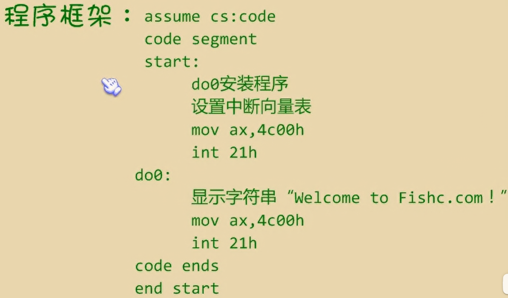

## 引言

中断是CPU处理外部突发事件的一个重要技术。

它能使CPU在运行过程中对外部事件发出的中断请求及时地进行处理，处理完成后又立即返回断点，继续进行CPU原来的互作。

引起中断的原因或者说发出中断请求的来源叫做中断源。根据中断源的不同，可以把中断分为硬件中断和软件中断两大类，而硬件中断又可以分为外部中断和内部中断两类。

## 中断向量表

CPU用8位的中断类型码通过中断向量表找到相应的中断处理程序的入口地址。

中断向量表在内存中保存，其中存放着256个中断源所对应的中断处理程序的入口

8086CPU的中断过程

(1)（从中断信息中）取得中断类型码；

(2) 标志寄存器的值入栈（保护标志位）

(3) 设置标志寄存器的第8位TF和第9位IF的

值为0；（这一步的目的后面将介绍）

(4) CS的内容入栈；

(5) IP的内容入栈；

(6)从内存地址为中断类型码\*4和中断类型\*码*4+2的两个字单元中读取中断处理程序的入口地址，设置IP和CS

有点像call

## 中断处理程序

### 常规的步骤

(1) 保存用到的寄存器

(2) 处理中断

(3) 恢复用到的寄存器

(4) 用 `iret` 指令返回

`iret` 指令的功能用汇编语法描述为：

`pop IP`

`pop CS`

`popf`

### 除法错误中断的处理

下面的内容中，我们通过对0号中断，即除法错误的中断处理，来体会一下前面所讲的内容

当CPU执行**div**等除法指令的时候，如果发生了除法溢出错误，将产生中断类型码为0的中断信息，

CPU将检测到这个信息，然后引I发中断过程，转去执行号中断所对应的中断处理程序

### 编程处理0号中断

程序分析一步步

一）当发生除法溢出的时候，产生0号中断信息，从而引发中断过程。此时，CPU将进行以下互作：

（1）取得中断类型码0；

（2）标志寄存器入栈，TF丶IF设置为O；

（3）CSIP入栈

（4）(IP)=(0\*4)，(CS)=(0*4+2)

二）可见，当中断0发生时，CPU将转去执行中断处理程序
只要按如下步骤编写中断处理程序，当中断0发生时；

即可显示Welcome to Fishc.com！

（1）相关处理
（2）向显示缓冲区送字符串“Welcome to Fishc.com
（3）返回DOS

我们将这段程序称为do0

三）、现在的问题是：do0应放在内存中。

因为除法溢出随时可能发生，CPU随时都可能将CS:IP指向do0的入O，执行程序

那么do0应该放在哪里呢？

由于我们是在操作系统之上使用计算机，所有的硬件资源都在操作系统的管理之下

所以我们要想得到一块内存存放do0，应该向操作系统申请

问题变得简单而直接，我们只需找到一块别的

程序不会用到的内存区，将do0传送到其中即可

前面讲到，内存0000:0000~0000:03FF，大小为1KB的空间是系统存放中断处理程序入口地址的中断向量表。

一般情况下，从**0000:0200至0000:02FF**的256个字节的空间所对应的中断向量表项都是空的，操作系统和其他应用程序都不占用。



## int中断

`int n` 

n为中断类型码。它的功能是引发中断过程

因此，一般情况下，系统将一些具有一定功能的子程序，以中断处理程序的方式提供给应用程序调用

int 21h 中断例程的在光标位置显示字符串的功能：

```assembly
ds:dx指向字符串;要显示的字符串需用作为结束符
mov ah,9;功能号9，表示在光标位置显示字符串
int 21h
```

在屏幕的5列12行显示

