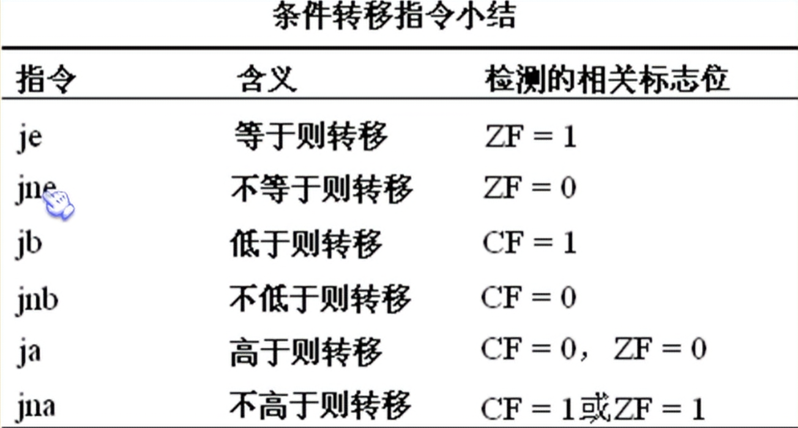

## flag

flag寄存器是按位起作用的

### ZF

**0标志位**

结果为0，则ZF为1

### PF

**奇偶标志位**

结果的所有二进制位中1的个数

为偶数，PF=1

为奇数，PF=0

### SF

**符号标志位**

结果为负，SF=1

结果为正，SF=0

### CF

第0位是CF，**进位标志位**

### OF

**溢出位**

### ADC

带进位加法指令，利用了CF位上记录的进位值

计算1EF000H+201000H结果放在ax（高16位）和bx（低16位）中

```assembly
mov ax,001EH
mov bx,0F000H
add bx,1000H
adc ax,0020H
```

### SBB

带借位剪发指令，利用了CF位上记录的借位值

### CMP

比较指令，不保存结果，仅进行比较

`cmp ax,ax`

结果为0，但不在ax中保存，仅影响flag的相关各位

### DF

**方向标志位**

在串处理指令中，控制每次操作后si，di的增减

DF=0：每次操作后si，di递增

DF=1：每次操作后si，di递减

格式1：**movsb**

格式2：**movsw** 传送字

rep和movsb/movsw搭配使用

rep是根据cx的值，重复执行后面的串传送指令。

**cld**指令：将标志寄存器的DF位置0

**std**指令：将标志寄存器的DF位置1

## PUSHF和POPF

pushf：将标志寄存器的值压栈;

popf：从栈中弹出数据，送入标志寄存器中 。

pushf 和 popf，为直接访问标志寄存器提供了一种方法。


## 检测比较结果的条件转移指令

通过cmp和影响的那些标志位，进行转移



e:equal

ne:not equal

b:bellow

nb:not bellow

a:above

na:not above

注意，这些都是cmp指令进行无符号数比较的时候，记录比较结果的标志位

### 在data段中比较8个字节，统计等于8的个数

```assembly
assume ds:data, cs:code
data segment
         db 8,11,8,1,8,5,63,38
data ends
code segment
    start:
          mov  ax,data
          mov  ds,ax
          mov  bx,0
          mov  ax,0
          mov  cx,8
    s:    cmp  byte ptr [bx],8
          jne  next
          inc  ax
    next: inc  bx
          loop s

          mov  ax,4c00h
          int  21h
code ends
end start
```

### 在data段中比较8个字节，统计大于8的个数

```assembly
assume ds:data, cs:code
data segment
         db 8,11,8,1,8,5,63,38
data ends
code segment
    start:
          mov  ax,data
          mov  ds,ax
          mov  bx,0
          mov  ax,0
          mov  cx,8
    s:    cmp  byte ptr [bx],8
          jna  next
          inc  ax
    next: inc  bx
          loop s

          mov  ax,4c00h
          int  21h
code ends
end start
```

### 在data段中比较8个字节，统计小于8的个数

```assembly
assume ds:data, cs:code
data segment
         db 8,11,8,1,8,5,63,38
data ends
code segment
    start:
          mov  ax,data
          mov  ds,ax
          mov  bx,0
          mov  ax,0
          mov  cx,8
    s:    cmp  byte ptr [bx],8
          jnb  next
          inc  ax
    next: inc  bx
          loop s

          mov  ax,4c00h
          int  21h
code ends
end start
```

## DF标志和串传送指令

### 用串传送指令，将data段中的第一个字符串复制到它后面的空间中

```assembly
assume ds:data, cs:code
data segment
         db 'Welcome to masm!'
         db 16 dup(0)
data ends
code segment
    start:
    ;传送的原始位置ds:si
    ;传送的目的位置es:di
    ;传送的长度cx
    ;传送的方向df
          mov ax,data
          mov ds,ax
          mov si,0
          mov es,ax
          mov di,16
          mov cx,16       ;rep循环16次
          cld
          rep movsb
          mov ax,4c00h
          int 21h
code ends
end start
```

### 将位于F000H段的最后16个单元中的字符串，存储到data

```assembly
assume ds:data, cs:code
data segment
         db 16 dup(0)
data ends
code segment
    start:
    ;传送的原始位置ds:si
    ;传送的目的位置es:di
    ;传送的长度cx
    ;传送的方向df
          mov ax,0F000h
          mov ds,ax
          mov si,0ffffh
          mov ax,data
          mov es,ax
          mov di,15        ;es:di指向data:15
          mov cx,16        ;rep循环16次
          std
          rep movsb
          mov ax,4c00h
          int 21h
code ends
end start
```

